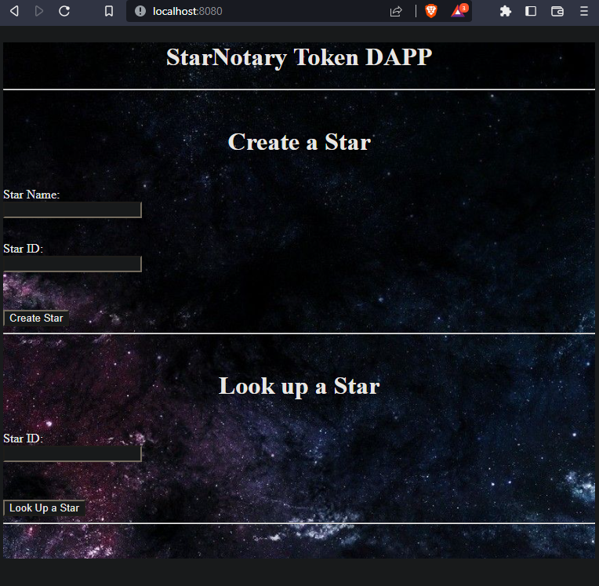

# Decentralized Star Notary Service Project

Projec to register, sale and buy stars on a blockchain app

# How to use it?

## Run the app in docker

Download the repo and type ...

Build the image <code>docker build -t testnetdapp . </code>

<figcaption>Docker image</figcaption>

 

Run the image and app <code>docker run -t -d -p 9545:9545 -p 8080:8080 testnetdapp </code>

<figcaption>Container</figcaption>

 

List the running containers <code>docker ps </code>

Enter the container terminal <code>docker exec -it [container id] bash </code>

<figcaption>Container terminal</figcaption>

 

Stop the container <code>docker stop **(first 2 container name characters) </code>

Once the app is running ...

## Start Truffle by running

#### For starting the development console

<code>truffle develop</code>

#### truffle console. 
#### For compiling the contract, inside the development console, run: 
<code>compile</code>

#### For migrating the contract to the locally running Ethereum network, inside the development console. 
<code>migrate --reset</code>

#### For running unit tests the contract, inside the development console, run: 
<code>test</code>

### Deploying smart contract on a public test network.

In this case we are using goerly. 

First make sure you set the test network data in the config file ...

<blockquote>
truffle-config.js
</blockquote>  

To edith the file on the container

<code>nano node_modules/browser-sync/dist/default-config.js</code>

<blockquote>
const HDWallet = require('truffle-hdwallet-provider');  
const infuraKey = "test network infura key";  
const mnemonic = "metamask mnemonic";
</blockquote>  

<code>truffle migrate --reset --network goerli</code> 
or  
<code>truffle migrate --network goerli --reset </code>

## Frontend - Once you are ready to start your frontend, run the following from the app folder:

Open another container terminal and type

<code>cd app</code>

<code>npm run dev</code>

On a browser window open http://localhost:8080/

<figcaption>Dapp UI</figcaption>

 

### Token symbol and name

<code>// name: Is a short name to your token </code> 
<code>string public name = "Alfa Tauri Token"; </code> 
<code>// symbol: Is a short string like 'USD' -> 'American Dollar' </code> 
<code>string public symbol = "a Tau"; </code>

### Transaction example
https://goerli.etherscan.io/tx/0x33379cc3a9632ee63c4929aca9ef25b5b384455903a8033a0bbeb72c961af096